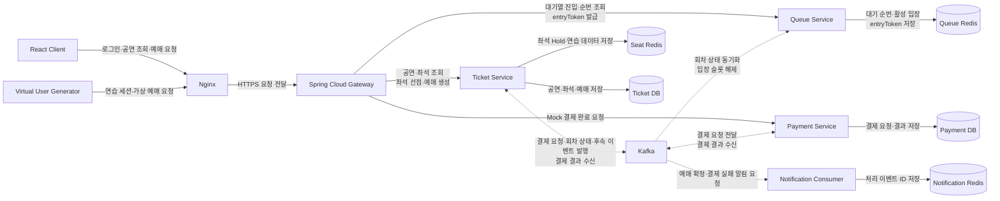

# 🎟️ Seat Rush

가상 사용자와의 좌석 경쟁, 대기열 제어, 원자적 좌석 선점, 이벤트 기반 결제를 결합한 티켓팅 연습 플랫폼

## 목차

1. [프로젝트 소개](#-1-프로젝트-소개)
2. [주요 기능](#-2-주요-기능)
3. [시스템 아키텍처](#-3-시스템-아키텍처)
4. [프로젝트 구조](#-4-프로젝트-구조)
5. [핵심 설계](#-5-핵심-설계)
6. [기술 스택](#-6-기술-스택)
7. [성능 개선](#-7-성능-개선)
8. [회고](#-8-회고)

## 🧭 1. 프로젝트 소개

### 프로젝트 기간

2026.06.10 ~ 2026.06.26

### 배경

- 인기 공연의 티켓 오픈 순간에는 짧은 시간에 요청이 집중되어 대기열과 좌석 동시성 제어가 필요하다.
- 기능 구현에 그치지 않고 실제 사용자가 가상 사용자와 좌석을 경쟁하며 전체 예매 흐름을 확인할 수 있는 환경을 만들고자 했다.
- 부하 테스트와 모니터링을 통해 병목을 직접 찾고, 같은 조건에서 개선 효과를 검증하는 경험을 목표로 했다.

### 목표

- Redis Sorted Set으로 대기 순서를 관리하고 제한된 사용자만 좌석 선택 단계에 입장시킨다.
- Redis Lua Script로 다중 좌석 선점의 원자성을 보장해 중복 예매를 방지한다.
- Outbox와 Kafka로 예매·결제·알림을 분리하고, k6와 Prometheus/Grafana로 성능을 측정한다.

## 🚀 2. 주요 기능

| 기능 | 설명 |
| --- | --- |
| 대기열 제어 | 회차별 대기열 등록, 순번 조회, 활성 입장 수 제한 기능 |
| 좌석 조회·선점 | 정적 좌석과 임시 선점 상태 조회, 최대 4개 좌석 원자적 선점 기능 |
| 예매·결제 | 좌석 선점 기반 예매 생성, Mock 결제 및 상태 연동 기능 |
| 비동기 알림 | 예매 확정·결제 실패 이벤트 소비 및 중복 알림 방지 기능 |
| 연습 경쟁 모드 | 실제 예매 데이터와 분리된 세션에서 가상 사용자와 경쟁하는 기능 |
| 성능 관측 | k6 부하 생성과 Prometheus/Grafana 기반 API·인프라 지표 분석 기능 |

## 🏗️ 3. 시스템 아키텍처



### 요청 흐름

1. 사용자는 Gateway를 통해 대기열에 진입하고 Queue Service에서 순번을 부여받는다.
2. 입장 가능한 사용자는 entryToken을 발급받아 Ticket Service의 좌석 API에 접근한다.
3. Ticket Service는 MySQL의 좌석 정보와 Redis의 임시 선점 상태를 결합하고 Lua Script로 좌석을 선점한다.
4. 예매 생성 시 결제 요청 Outbox를 함께 저장하고, Kafka를 통해 Payment Service에 전달한다.
5. Ticket Service는 결제 결과 이벤트를 반영하고 예매·좌석 상태와 후속 알림을 처리한다.

Ticket DB와 Payment DB는 서비스별로 논리 분리했으며, 현재 배포 환경에서는 비용을 고려해 하나의 MySQL 인스턴스 안에서 별도 데이터베이스로 운영한다.

## 📁 4. 프로젝트 구조

```text
seat-rush
├── backend
│   ├── api-gateway           # WebFlux 기반 라우팅, JWT 인증·인가
│   ├── ticket-service        # 공연, 좌석 선점, 예매 및 결제 결과 반영
│   ├── queue-service         # 대기열, 입장 제어 및 entryToken 발급
│   ├── payment-service       # Mock 결제 및 결제 결과 Outbox 발행
│   └── notification-consumer # 알림 이벤트 소비 및 중복 처리 방지
├── frontend                  # React, TypeScript, Vite 기반 웹 클라이언트
├── load-test
│   ├── k6                    # API 부하 테스트 시나리오와 결과
│   └── virtual-user-generator# WebFlux 기반 경쟁 모드 가상 사용자 생성기
├── e2e                       # 전체 예매 흐름 검증 스크립트
├── docs                      # 성능 분석과 개선 전후 측정 결과
└── infra                     # Docker Compose, Nginx, 모니터링, 배포 스크립트
```

| 디렉터리 | 역할 |
| --- | --- |
| `backend/queue-service` | Redis Sorted Set 대기열과 활성 입장 슬롯을 관리한다. |
| `backend/ticket-service` | DB 좌석 정보와 Redis 선점 상태를 결합하고 예매를 처리한다. |
| `load-test/k6` | 동일 조건의 단계별 부하를 발생시키고 API p90/p95/p99를 기록한다. |
| `infra` | 로컬·운영 인프라, 배포, HTTPS, 모니터링 구성을 관리한다. |
| `docs/performance-improvements` | 병목 원인, 변경 사항, 재측정 결과를 기록한다. |

## 🧩 5. 핵심 설계

### 1. Redis 역할 분리와 원자적 좌석 선점

- 대기열, 좌석 선점, 알림 중복 방지는 데이터 수명과 장애 범위가 달라 Queue·Seat·Notification Redis로 분리했다.
- 좌석 중복 확인, 다중 좌석 선점, Hold 생성과 TTL 설정을 Lua Script 한 번으로 처리한다.
- 좌석 하나라도 이미 선점됐다면 전체 요청을 실패시켜 부분 선점을 방지한다.

### 2. Outbox 기반 결제 이벤트 연동

- 예매와 결제 요청 Outbox를 같은 트랜잭션에 저장해 DB 변경과 이벤트 발행 요청의 기준점을 맞췄다.
- Ticket Service는 `payment-request-v1`, Payment Service는 `payment-result-v1`을 발행해 결제 흐름을 비동기로 분리했다.
- Consumer는 이벤트 ID와 현재 상태를 기준으로 중복 이벤트를 처리하고, 재시도 실패 메시지는 DLT로 이동시킨다.

### 3. 실제 예매와 연습 모드 격리

- 실제 좌석 배치는 재사용하되 연습 대기열, 좌석 선점, 예매 결과는 `practiceSessionId`가 포함된 별도 Redis Key로 관리한다.
- 연습 세션 데이터에 TTL을 적용해 종료된 연습이 실제 예매나 다음 연습에 영향을 주지 않게 했다.
- WebFlux 생성기는 준비된 계정으로 동시에 대기열에 진입하고 좌석 선택부터 Mock 결제까지 수행한다.

## 🛠️ 6. 기술 스택

### Backend


### Frontend


### Database / Cache / Messaging


### Infra / Monitoring


### 기술 선택 이유

| 기술 | 선택 이유 |
| --- | --- |
| Spring Boot | 트랜잭션이 중요한 공연·좌석·예매·결제 도메인 처리 |
| Spring Cloud Gateway | 단일 진입점에서 서비스 라우팅과 JWT 인증·인가 처리 |
| WebFlux | Gateway 비동기 I/O와 가상 사용자 생성기의 대량 동시 요청 처리 |
| Redis | Sorted Set 대기열, TTL 상태 관리, Lua 기반 원자적 좌석 선점 |
| Kafka | 결제·예매·알림·입장 슬롯 반환 이벤트 비동기 전달 |
| Prometheus/Grafana | API 지연과 JVM, HikariCP, Redis, Kafka, 호스트 지표 분석 |

## 📈 7. 성능 개선

### 측정 환경

- AWS EC2 `t4g.large` 1대에 Docker Compose로 애플리케이션과 인프라를 배포했다.
- 로컬 PC의 k6에서 준비된 사용자가 동시에 대기열에 진입해 좌석 조회, 선점, 예매, 결제까지 수행했다.
- 총 10,000석 중 사용자가 선택한 구역의 2,500석을 조회하고, 좌석 충돌 시 최대 5회 재시도했다.
- 단일 실행의 편차를 줄이기 위해 사전 부하 후 100 VU를 3회 실행하고 중앙값을 비교했다.

### 1. 대기열 Polling 및 TTL 갱신 최적화

순번 조회마다 사용자 TTL과 공통 연습 세션 Key를 갱신하던 구조를 Polling과 Heartbeat로 분리했다. Polling은 2초, Heartbeat는 10초 간격으로 실행하고 공통 Key는 남은 TTL이 기준 이하일 때만 연장하도록 변경했다.

| 지표 | 개선 전 p95 | 개선 후 p95 | 변화 |
| --- | ---: | ---: | ---: |
| 대기열 진입 | 1,473 ms | 606 ms | 58.9% 감소 |
| 내 순번 조회 | 1,252 ms | 588 ms | 53.0% 감소 |
| entryToken 발급 | 1,115 ms | 748 ms | 32.9% 감소 |

사용자별 Redis 쓰기 빈도를 1초마다 2회에서 10초마다 2회로 줄이면서 대기열 핵심 API의 p95가 모두 감소했다.

상세 내용: [대기열 Polling 및 TTL 갱신 최적화](docs/performance-improvements/2026-06-queue-polling-ttl-optimization.md)

### 2. JPA Constructor Projection 적용

좌석 조회 응답에 필요한 필드만 JPQL Constructor Projection으로 조회해 2,500개의 Seat Entity를 영속성 컨텍스트에 등록하던 비용을 줄였다.

| 지표 | 개선 전 p95 | 개선 후 p95 | 변화 |
| --- | ---: | ---: | ---: |
| Repository | 332 ms | 111 ms | 66.6% 감소 |
| 좌석 조회 | 2,151 ms | 1,652 ms | 23.2% 감소 |
| Ticket Servlet | 1,683 ms | 1,517 ms | 9.9% 감소 |
| API Gateway | 2,144 ms | 1,668 ms | 22.2% 감소 |

Repository 처리 시간은 크게 줄었지만 Redis Hold 조회와 커넥션 대기가 남아 다음 개선 대상으로 이어졌다.

### 3. 구역별 Redis Hold 인덱스 적용

기존에는 구역의 좌석 2,500개에 대해 Redis Key를 생성하고 `MGET`으로 선점 상태를 조회했다. 구역별 Sorted Set에 실제 선점된 좌석 ID와 만료 시각만 저장해 조회 범위를 줄였다.

| 지표 | 개선 전 p95 | 개선 후 p95 | 변화 |
| --- | ---: | ---: | ---: |
| Hold 조회 전체 | 356 ms | 175 ms | 50.8% 감소 |
| Redis Hold 조회 | 289 ms | 175 ms | 39.4% 감소 |
| 좌석 조회 | 2,016 ms | 1,231 ms | 38.9% 감소 |
| 전체 HTTP | 1,967 ms | 1,227 ms | 37.6% 감소 |

실제 선점 좌석 수와 관계없이 2,500개 Key를 처리하던 비용을 제거해 Redis 조회와 전체 좌석 응답 시간이 함께 감소했다.

상세 내용: [좌석 조회 성능 분석 및 개선](docs/performance-improvements/2026-06-seat-query-optimization.md)

### 4. 좌석 선점 중복 DB 검증 제거

좌석 목록을 조회한 뒤 각 좌석이 요청한 배치에 속하는지 다시 DB로 확인하던 로직을 제거했다. EntityGraph로 함께 조회한 `section.layout` 정보로 소속을 검증했다.

| 지표 | 개선 전 | 개선 후 | 변화 |
| --- | ---: | ---: | ---: |
| 좌석 선점 API p95 | 974 ms | 738 ms | 24.2% 감소 |
| 좌석 DB 검증 p95 | 201 ms | 102 ms | 49.2% 감소 |
| HikariCP pending 최대 중앙값 | 10 | 0 | 커넥션 대기 해소 |

좌석 수만큼 추가되던 존재 여부 조회를 제거해 DB 검증 시간과 커넥션 대기를 줄였다.

상세 내용: [좌석 선점 성능 분석 및 개선](docs/performance-improvements/2026-06-seat-hold-optimization.md)

### 5. 예매 생성 Redis 왕복 축소

예매 생성 전 별도로 수행하던 Hold 조회·소유권 검증과 TTL 연장을 Lua Script 한 번으로 합쳤다.

| 지표 | 개선 전 p95 | 개선 후 p95 | 변화 |
| --- | ---: | ---: | ---: |
| Hold TTL 연장 | 330 ms | 236 ms | 28.5% 감소 |
| 예매 생성 API | 762 ms | 1,083 ms | 321 ms 증가 |

내부 Hold 연장 구간은 개선됐지만 전체 API는 실행 환경과 Gateway 구간 편차로 빨라지지 않았다. 내부 구간 개선이 곧바로 전체 응답 개선을 의미하지 않는다는 점을 확인했다.

상세 내용: [Hold 연장 최적화](docs/performance-improvements/2026-06-reservation-hold-extend-optimization.md)

### 6. 중복 예매 SELECT 제거

동일한 Hold의 중복 예매를 확인하기 위해 트랜잭션 전후로 실행하던 `existsByHoldId` SELECT를 제거했다. `hold_id` UNIQUE 제약과 저장 시 발생하는 예외로 중복을 판정하도록 변경했다.

| 지표 | 개선 전 p95 | 개선 후 p95 | 변화 |
| --- | ---: | ---: | ---: |
| Ticket Service Facade | 522 ms | 418 ms | 19.9% 감소 |
| 예매 생성 API | 1,083 ms | 1,064 ms | 1.8% 감소 |
| 중복 예매 사전 조회 | 166 ms | 제거 | SELECT 제거 |
| 트랜잭션 내부 중복 조회 | 36 ms | 제거 | SELECT 제거 |

정상 요청마다 발생하던 SELECT 2회를 제거했으며, 전체 API보다 Ticket Service 내부 처리 구간에서 더 뚜렷한 개선을 확인했다.

상세 내용: [중복 예매 검증 최적화](docs/performance-improvements/2026-06-reservation-duplicate-check-optimization.md)

### 7. 고동시성 네트워크 수신 대기열 조정

호스트와 컨테이너의 `somaxconn`, `tcp_max_syn_backlog`, Nginx listen backlog, Gateway Netty backlog와 Queue Service Tomcat accept-count를 함께 조정했다.

| 규모 | 개선 전 예매 확정 | 최종 예매 확정 | 개선 전 실패율 | 최종 실패율 | 개선 전 p95 | 최종 p95 |
| ---: | ---: | ---: | ---: | ---: | ---: | ---: |
| 100 VU | 100 / 100 | 100 / 100 | 0.000% | 0.000% | 1,527 ms | 1,259 ms |
| 500 VU | 500 / 500 | 500 / 500 | 0.000% | 0.000% | 1,486 ms | 1,085 ms |
| 1,000 VU | 956 / 1,000 | 1,000 / 1,000 | 0.157% | 0.000% | 2,670 ms | 2,940 ms |
| 3,000 VU | - | 781 / 3,000 | - | 7.740% | - | 3.43 s |

1,000 VU에서는 연결 실패를 제거했지만 p95는 증가했다. 애플리케이션 개선과 네트워크 설정이 함께 반영된 결과이므로 변화 전체를 백로그 조정만의 효과로 보지는 않는다. 3,000 VU는 성공 처리 결과가 아니라 단일 인스턴스 구성의 한계 측정이다.

상세 내용: [네트워크 백로그 튜닝](docs/performance-improvements/2026-06-network-backlog-tuning.md), [개선 전 단계별 결과](docs/load-test-results/2026-06-20-k6-100-500-1000.md), [최종 3,000 VU 결과](docs/load-test-results/2026-06-24-k6-3000-users/README.md)
## 📝 8. 회고

### 잘한 점

- 대기열, 좌석 선점, 예매·결제 이벤트를 분리하고 Redis와 Kafka를 각 데이터 특성에 맞게 사용했다.
- API 전체 시간만 비교하지 않고 Micrometer 지표로 DB, Redis, 직렬화, Gateway 구간을 나누어 병목을 찾았다.
- 같은 조건의 k6 시나리오로 변경 전후를 반복 측정하고 유리하지 않은 결과도 함께 기록했다.

### 아쉬운 점

- 단일 EC2에 모든 서비스와 인프라를 배치해 서비스별 자원 격리와 수평 확장 효과를 검증하지 못했다.
- 1,000 VU에서 성공률은 확보했지만 p95가 2.94초로 증가해 안정성과 응답 속도를 함께 만족하지 못했다.
- 3,000 VU 실패를 CPU, 네트워크, 커넥션 풀 등 원인별로 완전히 분리해 측정하지 못했다.

### 다음 개선 방향

- Gateway와 핵심 서비스를 분리 배포하고 다중 인스턴스 환경에서 같은 부하 시나리오를 재측정한다.
- Polling 순번 조회를 SSE로 변경한 뒤 요청 수, 연결 유지 비용과 전달 지연을 비교한다.
- 3,000 VU 실패 요청을 단계별로 분류하고 서비스별 포화 지점을 별도 지표로 관리한다.