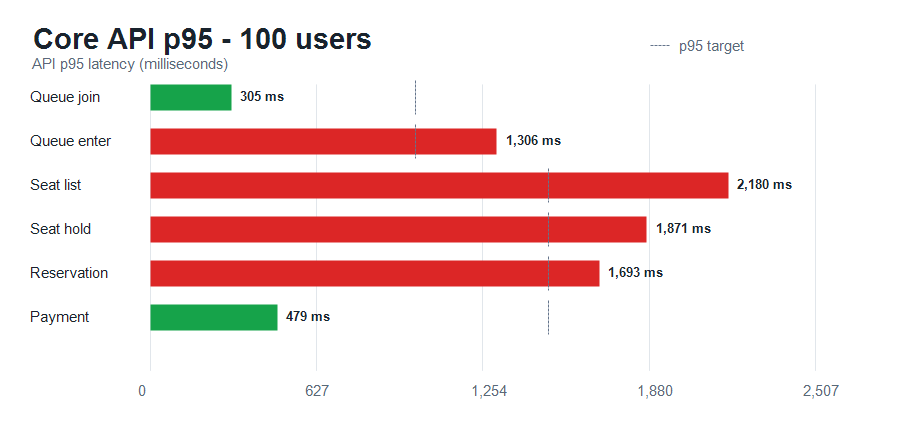
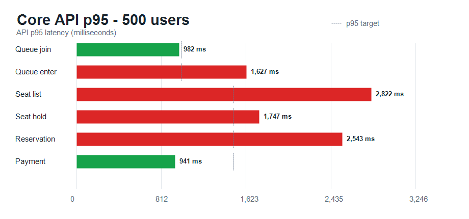

# k6 예매 흐름 단계별 측정 결과

## 목적

로그인이 완료된 사용자가 같은 시각에 대기열에 진입하는 티켓 오픈 상황을 기준으로,
100명부터 1,000명까지 전체 예매 흐름의 증가 양상을 확인합니다.

## 공통 조건

| 항목 | 값 |
| --- | --- |
| 대상 환경 | EC2 `t4g.large`, Docker Compose |
| 부하 생성기 | 로컬 PC의 k6 |
| 대상 주소 | 배포 API Gateway |
| 사용자 행동 | 결제 성공 100%, 중도 이탈 0% |
| 좌석 선택 | 사용자당 1~4석, 선점 충돌 최대 5회 재시도 |
| 인증 | 측정 시작 전 테스트 계정 토큰을 20개씩 갱신 |
| 오픈 방식 | 토큰 준비 완료 후 60초 대기, 같은 시각에 대기열 진입 |
| 워밍업 | 각 본 측정 전 10명, 5초 카운트다운으로 실행 후 15초 대기 |

로그인과 토큰 갱신은 사전 준비 단계이므로, 아래 API별 p90/p95/p99 결과에는 포함하지 않습니다.
좌석 선점 재시도 중 발생한 `400/409`는 정상 경합으로 분리 집계했습니다.

### 좌석 조회 데이터 규모

이번 결과의 좌석 조회는 작은 샘플 데이터가 아니라 연습 배치 ID `1`의 10,000석을 기준으로
수행했습니다. 4개 구역은 각각 2,500석이며, 한 사용자는 선택한 구역의 좌석 2,500석 전체를
조회합니다. 이후 Ticket Service는 같은 2,500개 좌석 ID에 대해 Seat Redis `MGET`으로 hold
상태를 읽어 DB 좌석 정보와 합칩니다.

따라서 아래 `좌석 조회` 지표는 단순 SELECT 한 번의 시간만 뜻하지 않습니다.

```text
구역 좌석 DB 조회(2,500건)
→ 좌석 ID 2,500개 생성
→ Redis MGET(hold 키 2,500개)
→ held 상태 병합 및 DTO 생성
→ JSON 직렬화·전송
```

## 전체 결과

| 동시 사용자 | 예매 확정 | HTTP 실패율 | 전체 HTTP p90 | 전체 HTTP p95 | 전체 HTTP p99 | 좌석 경합 재시도 | 판정 |
| ---: | ---: | ---: | ---: | ---: | ---: | ---: | --- |
| 100 | 100 / 100 | 0.000% | 1,224 ms | 1,527 ms | 2,108 ms | 2 | 정상 완료, 응답 시간 개선 필요 |
| 500 | 500 / 500 | 0.000% | 1,204 ms | 1,486 ms | 2,435 ms | 4 | 정상 완료, 응답 시간 개선 필요 |
| 1,000 | 956 / 1,000 | 0.157% | 2,281 ms | 2,670 ms | 3,681 ms | 17 | 대기열 polling 연결 실패 발생 |

1,000명에서는 일부 `queues/me` 요청이 `EOF` 또는 원격 연결 종료로 실패했습니다.
따라서 44명은 예매 확정까지 도달하지 못했고, 현재 단일 EC2 구성의 첫 명확한 한계 지점으로 기록합니다.

## 핵심 API 응답 시간

단위는 ms이며, 점선은 API별 p95 목표값입니다. 대기열 진입과 입장 토큰은 1,000ms,
좌석·예매·결제 API는 1,500ms를 목표로 둡니다.

| 100명 | 500명 | 1,000명 |
| --- | --- | --- |
|  |  |  |

### p90

| API | 100명 | 500명 | 1,000명 |
| --- | ---: | ---: | ---: |
| 대기열 진입 | 300 ms | 957 ms | 2,501 ms |
| 입장 토큰 발급 | 1,195 ms | 1,485 ms | 1,893 ms |
| 좌석 조회 | 2,078 ms | 2,590 ms | 2,626 ms |
| 좌석 선점 | 1,526 ms | 1,556 ms | 1,852 ms |
| 예매 생성 | 1,522 ms | 2,118 ms | 1,837 ms |
| 결제 완료 | 325 ms | 745 ms | 1,396 ms |

### p95

| API | 100명 | 500명 | 1,000명 |
| --- | ---: | ---: | ---: |
| 대기열 진입 | 305 ms | 982 ms | 2,586 ms |
| 입장 토큰 발급 | 1,306 ms | 1,627 ms | 2,461 ms |
| 좌석 조회 | 2,180 ms | 2,822 ms | 3,324 ms |
| 좌석 선점 | 1,871 ms | 1,747 ms | 2,008 ms |
| 예매 생성 | 1,693 ms | 2,543 ms | 1,990 ms |
| 결제 완료 | 479 ms | 941 ms | 1,607 ms |

### p99

| API | 100명 | 500명 | 1,000명 |
| --- | ---: | ---: | ---: |
| 대기열 진입 | 316 ms | 1,032 ms | 2,689 ms |
| 입장 토큰 발급 | 1,377 ms | 1,782 ms | 2,781 ms |
| 좌석 조회 | 2,418 ms | 3,094 ms | 3,846 ms |
| 좌석 선점 | 2,075 ms | 2,375 ms | 2,679 ms |
| 예매 생성 | 2,184 ms | 2,783 ms | 2,724 ms |
| 결제 완료 | 571 ms | 1,263 ms | 2,661 ms |

## 해석

- 500명부터 입장 토큰 발급·좌석 조회·예매 생성 p95가 목표를 초과했고, 1,000명에서는 모든 핵심 API가 목표를 넘었습니다.
- 1,000명에서는 API 지연뿐 아니라 Gateway 또는 하위 서비스 연결이 끊기는 현상이 발생했습니다.
- 다음 개선은 1,000명 이상을 바로 확대하기보다, 대기열 polling 요청량과 Ticket Service의 좌석 조회·예매 생성 경로를 먼저 분석하는 것이 적절합니다.

## 개선 고려 사항

아래 항목은 현재 결과와 코드 구조를 바탕으로 정리한 **가설**입니다. 아직 원인으로 확정하지
않았으며, 성능 개선 이슈에서 계측과 재측정으로 검증합니다.

| 우선순위 | 대상 | 관찰된 현상 또는 구조 | 개선 가설 | 검증 방법 |
| ---: | --- | --- | --- | --- |
| 1 | 좌석 조회 | 100명 p95 2.18s, 1,000명 p95 3.32s | 구역 2,500석 DB 조회 → 2,500개 hold 키 MGET → DTO/JSON 생성·전송 중 병목 구간 미확정 | DB 조회·Redis MGET·응답 크기·직렬화 시간을 각각 측정 |
| 2 | 좌석 조회 | 회차 존재 확인, 구역 존재 확인, 좌석 목록 조회가 분리됨 | 토큰의 회차 claim 검증은 유지하고, DB 검증 쿼리는 조회 쿼리와 통합할 수 있음 | 쿼리 수와 p95 비교, 다른 회차 section 접근 차단 회귀 테스트 |
| 3 | 좌석 hold 상태 | 전체 좌석 ID로 MGET 후 Boolean Map 생성 | 구역별 활성 hold ID만 조회하면 선점 수가 적을 때 Redis 전송량을 줄일 수 있음 | 현재 MGET과 section ZSet 기반 held seat 조회의 명령 수·payload·p95 비교 |
| 4 | hold 자료구조 | 좌석별 TTL 키는 정확하지만 구역 단위 상태 목록은 없음 | section별 ZSet에 `seatId → expiresAt`을 유지하면 만료된 hold를 정리하며 활성 hold만 반환할 수 있음 | hold/연장/해제 Lua Script의 원자적 동기화, TTL 만료 후 stale 데이터 회귀 테스트 |
| 5 | 좌석 응답 형식 | 매 요청마다 구역 좌석 전체를 응답 | 정적 배치도 캐시와 동적 hold 상태를 분리하거나 viewport/page 조회로 응답 크기를 줄일 수 있음 | 응답 바이트, 프론트 렌더링 시간, 재조회 빈도 비교 |
| 6 | Lua Script | hold·연장·해제가 Redis 단일 스레드에서 원자 실행 | 현재 최대 4석이라 Script 자체는 짧을 가능성이 높고, 제거보다 실행 시간 계측이 우선 | Redis command latency, script 실행 시간, CPU, slowlog 확인 |
| 7 | 연습 세션 정리 | 세션 종료 시 Redis `KEYS practice:{sessionId}:*` 사용 | 키 공간이 커지면 `KEYS`가 Redis를 블로킹할 수 있음 | 세션 수 증가 조건에서 command latency 측정 후 SCAN 또는 세션 키 manifest 방식 비교 |
| 8 | 대기열 polling | 1,000명에서 `queues/me` EOF/연결 종료 발생 | Gateway 연결/HTTP 커넥션, Queue Service 처리량, polling 집중이 원인 후보 | Gateway 5xx, 연결 수, Queue Redis 지연, Queue API p95/p99를 같은 시각에 비교 |
| 9 | 예매 생성 | 500명부터 p95 2.54s | hold 검증·TTL 연장 Redis 작업과 DB 예매 저장의 누적 비용 또는 커넥션 경합 가능성 | Redis/DB 구간별 타이머, HikariCP active/pending, DB 슬로우 쿼리 확인 |

### 구조 변경 전 원칙

- 좌석 선점의 Lua Script는 다중 좌석을 전부 성공시키거나 전부 실패시키는 원자성에 필요하므로,
  성능 우려만으로 제거하지 않습니다.
- entryToken의 서명·사용자·회차 claim 검증은 좌석 선택 단계의 접근 제어이므로 유지합니다.
  줄일 대상은 권한 검증이 아니라 중복 DB 조회와 대량 응답 처리입니다.
- section ZSet 같은 새 Redis 인덱스를 도입한다면, hold 생성·연장·해제와 TTL 만료 후 정리가
  기존 좌석별 hold 키와 항상 일치하도록 Lua Script에서 함께 갱신해야 합니다.
- 개선은 서로 연관된 항목을 한 이슈에서 묶어 적용한 뒤, 같은 워밍업·사용자 수·좌석 배치
  조건에서 재측정합니다.

## 측정 해석 주의

개선 전후 비교에서는 사용자 수별로 워밍업 실행 1회는 제외하고 최소 3회 반복한 뒤, p90/p95/p99의 중앙값을
대표값으로 사용합니다. 각 실행 사이에는 Kafka lag와 진행 중인 요청이 기준 상태로 돌아온 것을 확인한 뒤 다음
측정을 시작합니다.

## 원본 결과

- [100명 요약](./2026-06-20-k6-100-users/README.md)
- [500명 요약](./2026-06-20-k6-500-users/README.md)
- [1,000명 요약](./2026-06-20-k6-1000-users/README.md)

각 폴더에는 검증용 `summary.json`과 `k6-output.txt`도 함께 보관합니다. 원본 요약 파일에서는 access token을 제거했습니다.
