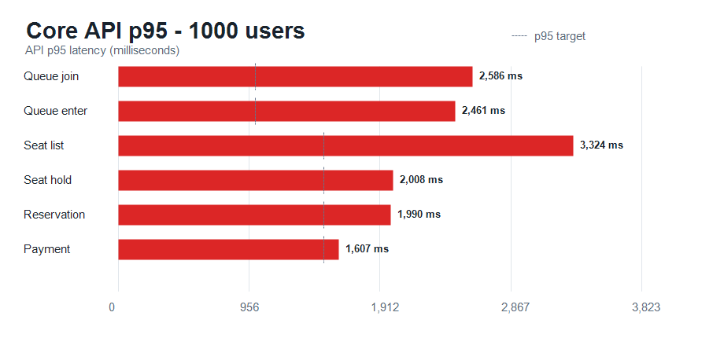

# k6 실행 결과: 1,000명

## 실행 조건

| 항목 | 값 |
| --- | --- |
| 시나리오 | 연습 예매 전체 흐름 |
| VU | 1,000 |
| 반복 | VU당 1회 |
| 결제 결과 | 성공 100% |
| 좌석 선택 | 1~4석, 선점 충돌 최대 5회 재시도 |
| 인증 | 측정 전 토큰 갱신 후 동시 대기열 진입 |
| 워밍업 | 10명, 5초 카운트다운 실행 후 15초 대기 |

## 체크 결과

| 항목 | 결과 |
| --- | ---: |
| 전체 체크 | 25,976건 |
| 성공 | 25,932건 |
| 실패 | 44건 |
| 예매 확정 | 956건 |
| 결제 실패 | 0건 |
| 중도 이탈 | 0건 |
| 좌석 선점 재시도 충돌 | 17건 |
| 최종 좌석 선점 실패 | 0건 |

## 전체 HTTP 결과

| 지표 | 값 |
| --- | ---: |
| 총 요청 수 | 27,949건 |
| 처리량 | 130.21 req/s |
| HTTP 실패율 | 0.157% |
| 평균 응답 시간 | 1,258 ms |
| 중앙값 응답 시간 | 1,134 ms |
| p90 | 2,281 ms |
| p95 | 2,670 ms |
| p99 | 3,681 ms |
| 최대 응답 시간 | 5,843 ms |

## API별 응답 시간

| API | p90 | p95 | p99 |
| --- | ---: | ---: | ---: |
| 대기열 진입 | 2,501 ms | 2,586 ms | 2,689 ms |
| 입장 토큰 발급 | 1,893 ms | 2,461 ms | 2,781 ms |
| 좌석 조회 | 2,626 ms | 3,324 ms | 3,846 ms |
| 좌석 선점 | 1,852 ms | 2,008 ms | 2,679 ms |
| 예매 생성 | 1,837 ms | 1,990 ms | 2,724 ms |
| 결제 완료 | 1,396 ms | 1,607 ms | 2,661 ms |

## 실행 및 네트워크

| 지표 | 값 |
| --- | ---: |
| 완료 iteration | 1,000 / 1,000 |
| 최대 VU | 1,000 |
| iteration p95 | 146,603 ms |
| 수신 데이터 | 220 MB |
| 송신 데이터 | 5.5 MB |

`iteration` 시간에는 티켓 오픈 전 60초 대기 시간이 포함됩니다.

## 원본 데이터

- [k6 원본 요약](./summary.json)
- [k6 실행 로그](./k6-output.txt)
