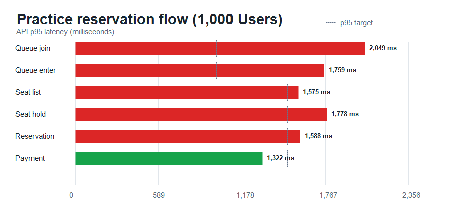

# k6 실행 결과: 1,000명 (최적화 후)

## 실행 조건

- 시나리오: 연습 예매 전체 흐름
- VU: 1,000
- 반복: VU당 1회
- 결제 결과: 성공 100%
- 좌석 선택: 1~4석, 선점 충돌 최대 5회 재시도
- 인증: 측정 시작 전 테스트 계정 토큰 갱신 후 동시 대기열 진입
- 워밍업: 50명, 30초 사전 예열 실행 후 DB/Redis 초기화 및 10초 대기

## 체크 결과

- 전체 체크: 22,105건
- 성공: 22,069건
- 실패: 36건
- 예매 확정: 964건
- 결제 실패: 0건
- 중도 이탈: 36건
- 좌석 선점 재시도 충돌: 16건
- 최종 좌석 선점 실패: 0건

## 전체 HTTP 결과

- 총 요청 수: 24,085건
- 처리량: 120.63 req/s
- HTTP 실패율: 0.14%
- 평균 응답 시간: 909.64 ms
- 중앙값 응답 시간: 864.53 ms
- p90: 1,618.43 ms
- p95: 1,805.25 ms
- p99: 2,034.22 ms
- 최대 응답 시간: 2,499.59 ms

## API별 응답 시간

| API | p90 | p95 | p99 |
| --- | ---: | ---: | ---: |
| 대기열 진입 | 1,980 ms | 2,049 ms | 2,146 ms |
| 입장 토큰 발급 | 1,610 ms | 1,759 ms | 1,890 ms |
| 좌석 조회 | 1,457 ms | 1,575 ms | 1,991 ms |
| 좌석 선점 | 1,434 ms | 1,778 ms | 2,077 ms |
| 예매 생성 | 1,369 ms | 1,588 ms | 1,976 ms |
| 결제 완료 | 1,212 ms | 1,322 ms | 1,630 ms |

## 실행 및 네트워크

- 완료 iteration: 1,000 / 1,000
- 최대 VU: 1,000
- iteration p95: 130,000 ms
- 수신 데이터: 220 MB
- 송신 데이터: 5.6 MB

## 원본 데이터

- [k6 원본 요약](./summary.json)
- [k6 실행 로그](./k6-output.txt)
