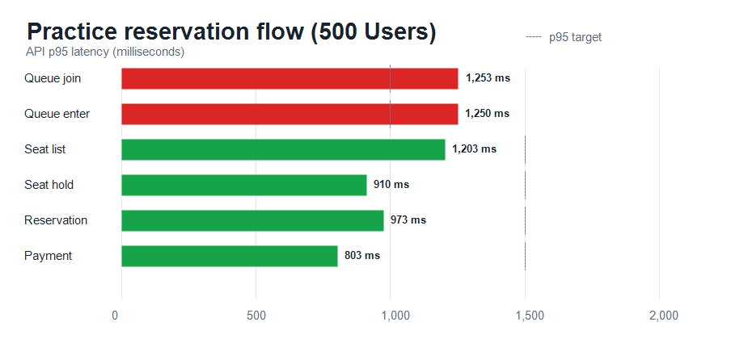

# k6 실행 결과: 500명 (최적화 후)

## 실행 조건

- 시나리오: 연습 예매 전체 흐름
- VU: 500
- 반복: VU당 1회
- 결제 결과: 성공 100%
- 좌석 선택: 1~4석, 선점 충돌 최대 5회 재시도
- 인증: 측정 시작 전 테스트 계정 토큰 갱신 후 동시 대기열 진입
- 워밍업: 50명, 30초 사전 예열 실행 후 DB/Redis 초기화 및 10초 대기

## 체크 결과

- 전체 체크: 6,967건
- 성공: 6,967건
- 실패: 0건
- 예매 확정: 500건
- 결제 실패: 0건
- 중도 이탈: 0건
- 좌석 선점 재시도 충돌: 7건
- 최종 좌석 선점 실패: 0건

## 전체 HTTP 결과

- 총 요청 수: 7,974건
- 처리량: 65.84 req/s
- HTTP 실패율: 0.00%
- 평균 응답 시간: 526.10 ms
- 중앙값 응답 시간: 501.51 ms
- p90: 919.16 ms
- p95: 1,084.97 ms
- p99: 1,338.28 ms
- 최대 응답 시간: 1,823.15 ms

## API별 응답 시간

| API | p90 | p95 | p99 |
| --- | ---: | ---: | ---: |
| 대기열 진입 | 1,177 ms | 1,252 ms | 1,464 ms |
| 입장 토큰 발급 | 1,131 ms | 1,250 ms | 1,446 ms |
| 좌석 조회 | 1,064 ms | 1,202 ms | 1,596 ms |
| 좌석 선점 | 831 ms | 910 ms | 1,047 ms |
| 예매 생성 | 890 ms | 973 ms | 1,240 ms |
| 결제 완료 | 739 ms | 803 ms | 971 ms |

## 실행 및 네트워크

- 완료 iteration: 500 / 500
- 최대 VU: 500
- iteration p95: 85,000 ms
- 수신 데이터: 112 MB
- 송신 데이터: 2.5 MB

## 원본 데이터

- [k6 원본 요약](./summary.json)
- [k6 실행 로그](./k6-output.txt)
