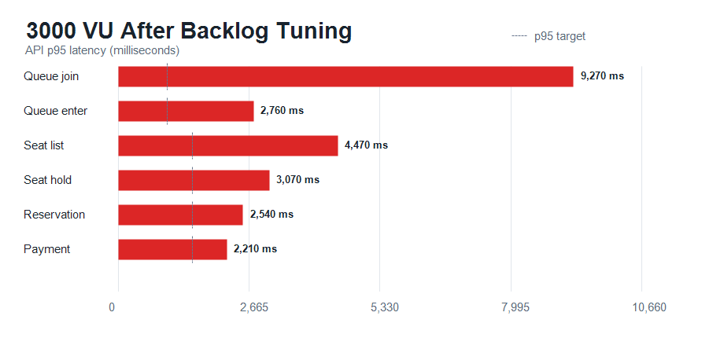

# k6 실행 결과: 3,000명 (최적화 및 백로그 튜닝 후 최종)

## 실행 조건

- 시나리오: 연습 예매 전체 흐름
- VU: 3,000
- 반복: VU당 1회
- 결제 결과: 성공 100%
- 좌석 선택: 1~4석, 선점 충돌 최대 5회 재시도
- 인증: 측정 시작 전 테스트 계정 토큰 갱신 후 동시 대기열 진입
- 워밍업: 50명, 15초 사전 예열 실행 후 DB/Redis 초기화

## 체크 결과

- 전체 체크: 24,856건
- 성공: 22,637건 (91.07%)
- 실패: 2,219건 (8.92%)
- 예매 확정: 781건 (성공한 유저들 기준)
- 결제 실패: 0건
- 중도 이탈: 0건
- 좌석 선점 재시도 충돌: 8건
- 최종 좌석 선점 실패: 0건

## 전체 HTTP 결과

- 총 요청 수: 28,645건
- 처리량: 74.99 req/s
- HTTP 실패율: 7.74%
- 평균 응답 시간: 1,420.00 ms
- 중앙값 응답 시간: 1,180.00 ms
- p90: 2,790.00 ms
- p95: 3,430.00 ms
- p99: 5,720.00 ms
- 최대 응답 시간: 14,690.00 ms

## API별 응답 시간

| API | p90 | p95 | p99 |
| --- | ---: | ---: | ---: |
| 대기열 진입 | 4,850 ms | 9,270 ms | 12,560 ms |
| 입장 토큰 발급 | 2,280 ms | 2,760 ms | 3,950 ms |
| 좌석 조회 | 3,620 ms | 4,470 ms | 5,940 ms |
| 좌석 선점 | 2,360 ms | 3,070 ms | 3,930 ms |
| 예매 생성 | 2,170 ms | 2,540 ms | 3,360 ms |
| 결제 완료 | 2,020 ms | 2,210 ms | 2,900 ms |

## 실행 및 네트워크

- 완료 iteration: 3,000 / 3,000
- 최대 VU: 3,000
- iteration p95: 160,000 ms
- 수신 데이터: 185 MB
- 송신 데이터: 9.0 MB

## 원본 데이터

- [k6 원본 요약](./summary.json)
